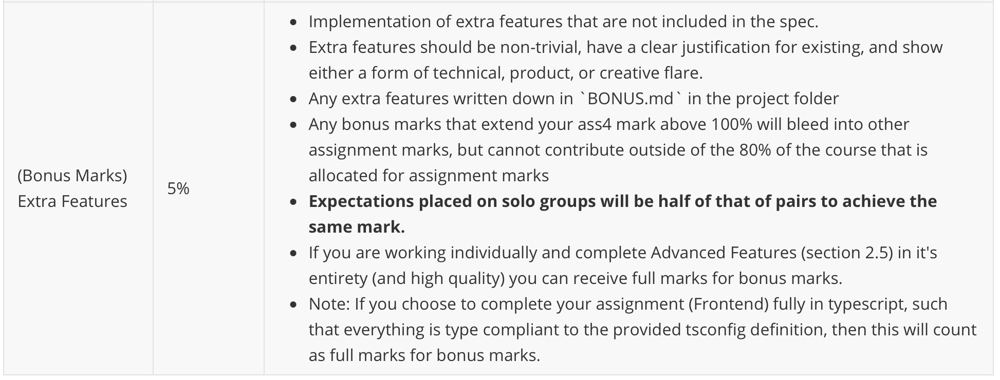

## Bonus Features in AirBrB Application

- **Listing Images Carousel**: To provide an immersive experience, I implemented a Carousel component for showcasing property images in landing page. Users can easily browse through multiple images, enhancing their ability to evaluate a listing's visual appeal.

- While I'm not certain if the README.md has a typo where it mentions 2.6 instead of 2.5, based on the README.md (see below screenshot), it states that if the assignment is completed individually and with high quality in section 2.5, then the bonus can be awarded with full marks. I completed section 2.5 as a solo group, and I believe the quality of 2.5 part is reasonably high.

  

- I have also successfully completed section 2.6.1(this part is not required for solo), which focuses on advanced listing rating viewing features. In this section:

  - When you hover over the star rating, a tooltip appears, displaying a breakdown of how many people have rated the booking within each star category. This breakdown is presented both in percentage terms and absolute terms.
  - Additionally, if you click on a specific star rating, another screen opens to show all of the individual reviews left for that particular rating.

- Convenient page design includes a house icon in the upper right corner that allows users to return to the homepage at any time. Additionally, both the login and registration pages feature buttons that enable users to switch between them.

- Every listing detail page I've presented utilizes an attractive grid layout to showcase up to five images of the details. The average star rating of my forms is visible on the default page of the search form.

- If a user searches for listings by date range and clicks into a details page from the search results page, the booking component will automatically pre-fill the user's previously entered start date, end date, and price.

  

